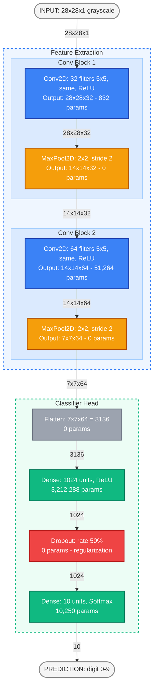

# CNN Architecture - MNIST Digit Classification

## Network Architecture Diagram

---

## Color Legend

| Color | Layer Type | Purpose |
|:---:|:---|:---|
| 🔵 Blue | **Conv2D** | Learnable convolutional filters that extract spatial features (edges → textures → parts) |
| 🟠 Orange | **MaxPooling2D** | Down-samples feature maps, reducing spatial dimensions by half while keeping strongest activations |
| ⚪ Gray | **Flatten** | Reshapes the 3-D feature tensor into a 1-D vector for the dense layers |
| 🟢 Green | **Dense (FC)** | Fully connected layers that learn non-linear combinations of features |
| 🔴 Red | **Dropout** | Regularization layer — randomly disables 50 % of neurons during training to prevent overfitting |

---

## Tensor Dimensions Through the Network

| # | Layer | Output Shape | Parameters | Notes |
|:-:|:------|:------------|----------:|:------|
| 0 | Input | 28 × 28 × 1 | — | Single-channel grayscale image |
| 1 | Conv2D (32, 5×5) | 28 × 28 × 32 | 832 | `padding='same'` keeps spatial dims; (5·5·1+1)·32 = 832 |
| 2 | MaxPooling2D (2×2) | 14 × 14 × 32 | 0 | Halves height & width |
| 3 | Conv2D (64, 5×5) | 14 × 14 × 64 | 51,264 | (5·5·32+1)·64 = 51,264 |
| 4 | MaxPooling2D (2×2) | 7 × 7 × 64 | 0 | Halves height & width again |
| 5 | Flatten | 3,136 | 0 | 7 × 7 × 64 = 3,136 |
| 6 | Dense (ReLU) | 1,024 | 3,212,288 | 3,136 × 1,024 + 1,024 biases |
| 7 | Dropout (0.5) | 1,024 | 0 | Active only during training |
| 8 | Dense (Softmax) | 10 | 10,250 | 1,024 × 10 + 10 biases |

> **Total trainable parameters: 3,274,634** (~3.27 M)

---

## Training Configuration

| Hyperparameter | Value |
|:---|:---|
| **Optimizer** | Adam (lr = 1 × 10⁻⁴) |
| **Loss function** | Categorical Cross-Entropy |
| **Metric** | Accuracy |
| **Batch size** | 75 |
| **Iterations** | ~2,000 (~2.5 epochs over 60,000 training samples) |
| **Validation split** | 10 % of training data |

---

## Key Concepts Illustrated

### Why `padding='same'`?
Preserves the spatial dimensions after convolution so no edge pixels are lost. Without it, a 5×5 kernel on a 28×28 image would produce a 24×24 output.

### Why two Conv → Pool blocks?
Each block progressively learns **higher-level features**:
- **Block 1** (32 filters): edges, corners, simple textures  
- **Block 2** (64 filters): combinations of edges → digit strokes, curves, loops

### Why Dropout?
With **3.2 M parameters** in the first Dense layer alone, the model can easily memorize the training set. Dropout randomly silences 50 % of neurons each training step, forcing the network to learn redundant, robust representations.

### Why Softmax + Categorical Cross-Entropy?
Softmax converts the 10 raw logits into a valid probability distribution (sums to 1). Categorical cross-entropy then measures how far that distribution is from the one-hot ground truth — the standard pairing for multi-class classification.
